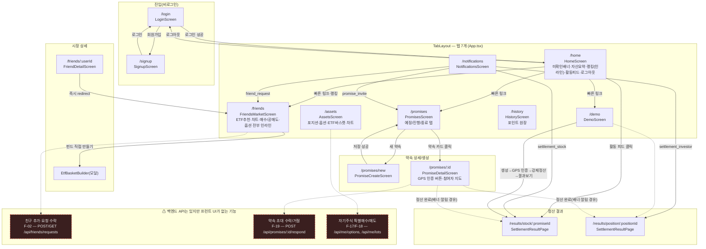
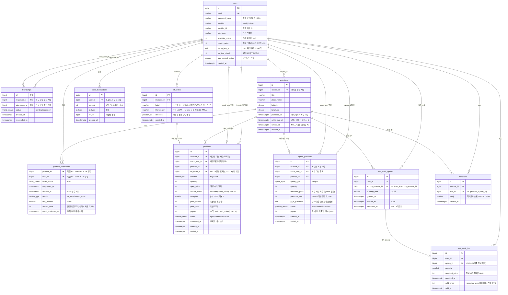
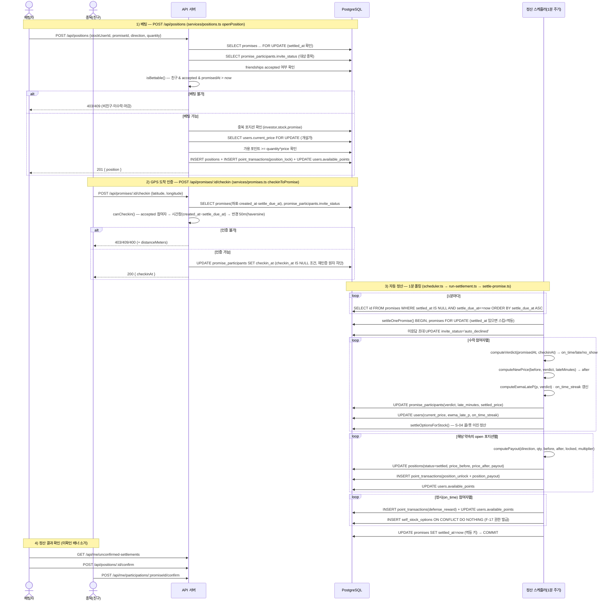

# 지각비 주식 시장 (Latestock)

**공통과제 I : 웹 기반 프로젝트 (2인 1팀)** — `26s-w1-c1-06`

친구의 시간 약속 준수를 가상의 "주식"으로 표현하고, GPS 기반 도착 인증 결과가 약속 단위로 주가에 반영되는 소셜 게임형 웹 서비스입니다. 친구가 약속에 늦으면 그 친구의 주가가 내려가고, 정시에 도착하면 올라갑니다. 다른 친구들은 "이 친구가 늦을지 안 늦을지"에 가상 포인트를 걸고 투자(매수)하거나 공매도합니다.

> 이 서비스는 "지각을 실제로 줄이겠다"고 약속하지 않습니다. 아무도 공식적으로 다루지 않던 '시간 약속'이라는 사회적 규칙을, 처벌이 아니라 게임으로 표면 위에 올리는 것이 목적입니다.

---

## 팀원

| 이름 | GitHub | 역할 |
|---|---|---|
|  |  |  |
|  |  |  |

---

## 기획안

- **주제:** 친구의 지각/정시 여부를 가상 주식으로 만들어 서로 투자·공매도하는 소셜 게임
- **목적:** 처벌이 아니라 게임으로 "지각"이라는 사회적 문제를 눈에 보이게 만든다. 주가는 오직 GPS 인증에 기반한 약속 판정 결과로만 움직이며(랜덤 변동 없음), 늦길 바라는 힘(공매도)과 정시를 바라는 힘(매수·자기 방어)이 공존하는 양방향 시장을 만든다.
- **핵심 기능:**
  - 친구 요청/수락(동의 기반) → 상호 종목 조회·베팅 권한 성립
  - 약속 생성 + 초대 응답(수락자만 판정·베팅 대상)
  - GPS 기반 도착 인증(반경 50m) → 정시/지각/노쇼 판정
  - 약속 단위 자동 정산(1분 주기 스케줄러, 멱등) → 주가 변동 + 포지션 손익 정산
  - 친구의 특정 약속에 대한 매수(정시 베팅)/공매도(지각 베팅) 포지션
  - 자기 주식 특례: 정시 도착 시 방어 보상 + 스톡옵션형 특별매수 권한, 취득 후 손절 불허 매도
  - 주가 차트, 자산 현황, 정산 결과 공유 카드(밈 톤, 이니셜 마스킹)
  - (선택) ETF 바스켓, 옵션(콜/풋), 레버리지 베팅, 랭킹, 알림, 이모지 리액션 등
- **예상 사용자:** 친구·지인 그룹 단위로 약속이 잦고, 그중 지각이 잦은 친구가 있는 20대 전후 사용자. 실제 화폐가 걸리지 않는 가상 포인트 기반 유머 게임이므로 친밀한 소규모 그룹 사용을 전제로 한다.
- **팀원별 역할:**

---

## 기능 명세서

> v7 기준. 서비스 전반의 "누가 언제 무엇을 알 수 있는가"를 규정하는 공개 규칙(R-1~R-7)과 저비용 재미 요소(I-1~I-5)가 아래 각 기능 설명에 인라인으로 녹아 있다. "화면" 열은 [IA 및 화면 설계서](#ia-및-화면-설계서)의 화면 ID를 가리킨다.

### 핵심 개념 정의

| 개념 | 정의 |
|---|---|
| 현재가 | 해당 종목의 최근 정산가. 약속 정산 시에만 갱신되며, 약속 사이에는 변하지 않는다(모델 B) |
| 약속 종료 시각 | 약속 시각 + 노쇼 상한 60분. 이 시각에 모든 참여자의 판정이 확정 가능해진다 |
| 포지션 | (유저, 종목, 대상 약속, 방향[매수/공매도], 수량, 잠금 포인트)의 묶음. 반드시 특정 약속에 연결된다 |
| 베팅 가능 구간 | 약속 생성 시점 ~ 약속 시각. 그 이후는 인증 현황(미인증=지각 진행 중)이 노출되므로 신규 포지션을 금지한다(확정 정보 베팅 차단) |
| 잠금 포인트 | 포지션 개설 시 수량 × 개설 시점 현재가만큼 가용 포인트에서 잠금. 정산 시 전액 반환 후 손익 반영 |
| 손익 | 수량 × (해당 약속 정산이 유발한 가격 변동분). 다른 약속의 정산으로 인한 가격 변동은 손익에 포함되지 않는다. 손실은 잠금 포인트를 상한으로 클램프 |
| 카운터파티 | 시스템(하우스). 매수자-공매도자 매칭 없이 손익만큼 시스템이 포인트를 발행/회수한다. 랭킹(S-06)은 절대 포인트가 아닌 수익률 기준으로 산정해 포인트 총량 변동과 무관하게 공정하다 |
| 실보유 주식 | 자기주식(F-17로 취득)만 존재. 타인 주식은 보유 개념이 없고 포지션만 존재 |

### 설계 원칙

| ID | 원칙 | 설명 |
|---|---|---|
| P-1 | 가시화 우선 | "지각을 줄인다"가 아니라 "지각을 보이게 한다"만 약속. 주가는 오직 약속 판정 결과로만 변동(랜덤 없음) |
| P-2 | 양방향 시장 | 공매도(지각 베팅)와 매수(정시 베팅·종목 본인 방어)가 동등하게 공존 |
| P-3 | 동의 기반 | 친구 수락(F-02, 조회·베팅 권한 부여) + 약속 초대 수락(F-19, 판정·베팅 대상 성립), 이중으로 동의를 전제 |
| P-4 | 톤 가드레일 | 모든 문구는 유머 톤, 인신공격 금지(예: "폭락했습니다 😱" O / "역시 너답다" X) |
| P-5 | 자기 주식 특례 | 평상시 자기 주식 매수·공매도 불가. 정시 도착 등 실제 성과가 있을 때만 제한된 보상성 매수 권한(F-17) |

### 필수 기능 (1차, MVP)

> **구현** 열은 `apps/api`(백엔드)와 `apps/web`(프런트엔드) 코드를 모두 뒤져 실제로 호출부가 있는지 확인한 결과다. "⚠️ 백엔드만"은 API·DB·테스트는 존재하지만 `apps/web/src`에 그 엔드포인트를 호출하는 코드가 전혀 없어 지금 배포된 화면에서는 실행할 수 없는 기능을 뜻한다(검증 방법은 [실제 구현된 화면 흐름](#실제-구현된-화면-흐름-코드-검증됨) 참고).

| ID | 기능명 | 설명 | 화면 | 구현 |
|---|---|---|---|---|
| F-01 | 회원가입 / 로그인 / 로그아웃 | 이메일 로그인. **가입 시 본인 지각 주식이 자동 발행**(기본가 10,000원, 유저당 1개·전역 단일가 — R-3) | SC-01, SC-02, SC-25 | ✅ |
| F-02 | 친구 요청 & 수락 | 수락 = 상호 조회·베팅 권한 성립(주식 발행은 가입 시 기완료). 전역 단일가이므로 다른 그룹 약속 결과도 동일 가격에 반영됨을 동의 문구에 명시(P-3) | SC-04(진입), SC-05, SC-06 | ⚠️ 백엔드만 — `POST/GET /api/friends/requests*`, `GET /api/users/search` 호출부가 `apps/web/src`에 없음. 친구 관계는 현재 시드 데이터에 의존 |
| F-03 | 친구(종목) 목록 조회 | 종목명·현재가·등락률. 홈=요약, 시장=전체 리스트로 역할 분리 | SC-03(요약), SC-04(전체) | ✅ |
| F-04 | 약속 생성 | 장소(좌표)·시간·초대 친구 입력. **초대 대상 = 생성자의 친구만(R-6)**, 생성자는 자동 수락. 생성 후 변경 불가(베팅 무효화 방지) | SC-07, SC-08, SC-09 | ✅ |
| F-19 | 약속 초대 응답 | 초대받은 유저가 수락/거절. **수락한 유저만 판정·베팅 대상**(거절·미응답은 주가 영향 없음). 약속 시각 도래까지 미응답이면 자동 거절 | SC-07, SC-08(발송), SC-09 | ⚠️ 백엔드만 — `POST /api/promises/:id/respond` 호출부가 프런트에 없음. `PromiseDetailScreen`은 초대 상태를 칩으로 표시만 하고 수락/거절 버튼이 없어, 실제로 작동하는 경로는 백엔드의 자동 거절뿐 |
| F-05 | GPS 도착 인증 | 약속 장소 반경 50m·종료 시각 전에만 인증 가능. 조기 인증=정시 처리. **[R-1] 약속 시각 전에는 본인 인증 상태만 표시, 타인은 마스킹**(확정 정보로 무위험 베팅 차단) — 약속 시각 이후 전체 공개 | SC-09 | ✅ |
| F-06 | 지각 판정 | 인증시각 ≤ 약속시각 → 정시, 초과 시 지각(분 단위 올림). 종료 시각까지 미인증 → 노쇼=지각 60분(단리) 확정 | SC-09, SC-10 | ✅ |
| F-07 | 주가 변동(약속 단위 정산) | **약속 정산 시 1회만 변동(모델 B)**: 정시=고정 상승률, 지각=지각 분수 비례 하락(단리), 하한가 클램프. 랜덤 변동 없음(P-1) | SC-03, SC-04, SC-11, SC-14 | ✅ |
| F-08 | 주가 히스토리 저장 | 약속(정산) 회차별 정산가를 시계열로 저장(별도 히스토리 테이블 없이 참여 판정과 겸용) | SC-11, SC-14 | ✅ |
| F-09 | 가상 포인트 지급 | 가입 시 기본 포인트(100,000P) 지급. 가용/잠금 포인트 구분 관리 | SC-02, SC-03, SC-15 | ✅ |
| F-10 | 매수 포지션(정시 베팅) | **내 친구인 종목만 대상**(R-5, 비친구는 이름만 표시). 특정 약속 선택 필수, 잠금=수량×현재가, 손익 미리보기 제공(I-1). 자기 주식 불가(F-17로만), 동일 (유저,종목,약속) 1포지션 제한 | SC-11, SC-12 | ✅ |
| F-11 | 공매도 포지션(지각 베팅) | F-10과 대칭 구조(약속 선택 필수·잠금·마감·1포지션 제한 동일). 손익 = 수량 × (정산 전가 − 정산 후가) | SC-11, SC-13 | ✅ |
| F-12 | 자동 정산 | **서버 스케줄러가 1분 주기로 미정산 약속을 폴링** → 판정 확정 → 가격 갱신 → 전 포지션 정산 → 보상/권한 발급 순 처리. **멱등 보장**, 결과는 미확인 상태로 기록되어 홈·자산 화면 배너로 도달 보장 | 백엔드 + SC-09/10/16, 배너 SC-03/15, 강제 실행 SC-24 | ✅ |
| F-13 | 주가 차트 조회 | 정산 회차별 종가 꺾은선, 정시 회차 마커(P-2) | SC-11(타인 전용), SC-14(본인) | ✅ |
| F-14 | 내 자산 현황 | 가용/잠금 포인트, 진행 중 포지션(종목·약속·방향·수량), 실현 손익. 자기주식 보유분은 구분 표시 | SC-15, SC-16 | ✅ |
| F-15 | 정시 방어 보상 | 종목 본인이 정시 도착 시 소액 고정 포인트 지급. **포인트 보유량과 무관하게 지급되어 전액 손실(파산) 유저의 유일한 무자본 회복 경로를 겸함** | SC-10, SC-14 | ✅ |
| F-16 | 데모 모드 | 좌표/시각 override로 F-05~F-12·F-15·F-17~F-19 전체 루프 재현. **정산 강제 실행 버튼**(스케줄러 대기 없이 즉시 정산, 멱등이라 안전) | SC-24, SC-25(진입) | ✅ |
| F-17 | 자기 주식 특별 매수(스톡옵션형) | 정산에서 본인 정시 확정 시 권한 발급(2~3주 한도, 유효 24h). **행사가 = 행사 시점 현재가(R-2)** — 발급 시점 가격 고정 시 생기는 "권한가 매수 → 즉시 매도" 차익 루프를 차단 | SC-10(안내), SC-14(행사) | ⚠️ 백엔드만 — `GET /api/me/options`, `POST /api/me/options/:id/exercise` 호출부 없음(관련 훅 자체가 `apps/web/src/hooks/`에 없음) |
| F-18 | 자기 주식 매도 | 현재가(최근 정산가) 즉시 체결. **취득가 이하 매도(손절) 불허**, 취득 단위(로트)별 취득가 기준 판정 | SC-14 | ⚠️ 백엔드만 — `GET /api/me/lots`, `POST /api/me/lots/:id/sell` 호출부 없음(동일 사유) |
| F-20 | 정산 결과 공유 카드 | 클라이언트 사이드 렌더링 밈 카드(서버 비용 없음). **[R-4] 주인공=공유자 본인 손익, 타인(종목) 이름은 이니셜 마스킹**(종목 본인이 자기 결과 공유 시에만 실명). 판정→밈 등급 라벨 고정 매핑(`packages/shared/src/constants.ts`의 `MEME_LABELS` 원본: 정시 "상한가 🔼" / 1~10분 "숨고르기 😮‍💨" / 11~30분 "폭락장 😱" / 31~59분 "서킷브레이커 🚨" / 노쇼 "상장폐지 💀". S-08 조기 청산 결과는 "조기 청산 💰"로 별도 표기) | SC-10 | ✅ |

### 선택 기능 (2차, 확장)

| ID | 기능명 | 설명 | 화면 | 구현 |
|---|---|---|---|---|
| S-01 | 정시 연속 기록 / 명예 배지 | 정산 배치 카운터 갱신으로 "🔥 N연속 정시" 노출(1단계, I-4). N회 달성 시 배지 부여(2단계) | SC-11(스트릭), SC-22(배지) | ✅ (1단계, `StockRankingTable`에 스트릭 배지) |
| S-02 | 실시간 위치 공유 | 약속 시각 경과 후 지각 중인 참여자 위치 표시(관전·응원 요소) | SC-09 | ❌ 미구현 |
| S-03 | ETF(묶음 펀드) | 여러 친구를 묶은 바스켓 주문(2~5개 leg, 전체 leg 공통 방향·수량). 구성 종목별 leg가 각자의 약속 정산 시 기존 정산 엔진 그대로 처리(바스켓 전용 정산 로직 없음, leg별 부분 정산 가능). 지각 이력(EWMA) 기반 추천 테마(**3인 그룹 단위**, side당 최대 1개) + 직접 만들기 지원 | SC-04(진입), SC-17 | ✅ |
| S-04 | 옵션 거래(콜/풋) | strike 없는 이진 상품. EWMA 지각확률 기반 프리미엄(L-01, 풋=기준가×p×수량 / 콜=기준가×(1-p)×수량), 콜=정시 승리·풋=지각/노쇼 승리, 패배 시 프리미엄만 손실(상한 고정) | SC-11(진입), SC-18 | ✅ |
| S-05 | 레버리지 베팅 | 포지션 손익에 배수(3x/5x/10x) 적용, 잠금(마진)은 배율과 무관하게 고정. 실시간 마진콜 없이 **정산 시 1회 판정**, 청산 조건은 개설 시점에 결정론적으로 확정 고지(L-02) | SC-11(진입), SC-19 | ✅ |
| S-06 | 랭킹 / 커뮤니티 | 내 친구 범위 한정 수익률 랭킹(절대 포인트 아님 — 카운터파티 정합) + 나·친구들의 최근 정산 소식을 모은 활동 피드 | SC-21, SC-03(활동 피드), SC-25(진입) | ✅ (`RankingCard`·`FriendActivityFeed`가 SC-21 대신 홈에 인라인 노출) |
| S-07 | 알림 센터 | 미확인 정산 + 받은 친구요청 + 받은 약속초대를 통합한 알림함(1차 미확인 배너의 고도화) | SC-03(아이콘), SC-23 | ✅ |
| S-08 | 정산 전 포지션 취소 | 베팅 마감(약속 시각) 전 포지션 철회 시 현재가 기준 즉시 정산(조기 청산). v1의 "임의 시점 숏 청산"은 모델 B에서 가격이 정지하므로 무의미해져 재정의됨 | SC-15(진입), SC-20 | ✅ (`OpenPositionsPanel`에서 청산) |
| S-09 | 이모지 리액션 | 정산 결과에 정해진 이모지(😱📉🛡️🔥)로만 반응. 자유 텍스트 없음(P-4 가드레일을 구조로 보장), 재반응 시 갱신 | SC-11 | ✅ (`ReactionBar`, 정산 결과 화면) |
| L-01 | 동적 프리미엄 산정(EWMA, S-04 연계) | `p_t = α × I_late + (1-α) × p_(t-1)`, **α = 0.25, 초기값 p₀ = 0.5**. 약속 정산 시점에 재계산·저장. 산출된 p는 "지각 위험도 N%" 배지로도 재사용(I-5) | SC-18 + 백엔드, SC-11(위험도 배지) | ✅ |
| L-02 | 청산 조건 고지(S-05 연계) | 레버리지 포지션 **개설 시점에 청산 조건을 결정론적으로 계산해 고지**("이번 약속에서 ○○이(가) N분 이상 지각하면 잠금 포인트 전액이 청산됩니다"). 정산 시 조건 충족 여부를 1회 판정(실시간 마진콜 아님) | SC-19(사전 고지), SC-23(결과) | ✅ (`OrderPanel`에 배율 선택 시 동일 문구 노출) |

<details>
<summary>핵심 기능 수용 기준 (Given–When–Then, 펼치기)</summary>

**F-19 약속 초대 응답**
- Given 초대받은 유저 / When 수락 / Then 참여자(판정·베팅 대상)로 등록
- Given 초대받은 유저 / When 거절 / Then 판정·베팅 대상 제외, 주가 영향 없음
- Given 미응답 상태 / When 약속 시각 도래 / Then 자동 거절 처리
- Given 미응답·거절 유저 / When 해당 약속으로 베팅 시도 / Then 거부(베팅 대상 아님)

**F-05 GPS 도착 인증**
- Given 수락한 참여자 & 반경 50m 이내 & 종료 시각 전 / When 인증 / Then 성공 + (유저, 약속, 인증시각) 저장
- Given 반경 50m 밖 / When 인증 시도 / Then 거부 + "범위 밖" 안내
- Given 약속 종료 시각 경과 / When 인증 시도 / Then 거부(노쇼 확정)
- Given 이미 인증한 참여자 / When 재인증 / Then 최초 인증만 유효
- Given 미수락 유저 / When 인증 시도 / Then 거부
- Given 약속 시각 전 & 참여자 A 조기 인증 완료 / When 타 유저가 참여자 현황 조회 / Then A의 인증 여부·시각 비노출(마스킹, R-1) — 본인 조회 시에는 표시
- Given 약속 시각 경과 / When 참여자 현황 조회 / Then 전원 인증 상태 공개

**F-06 지각 판정**
- Given 인증시각 ≤ 약속시각 / Then 정시
- Given 인증시각 > 약속시각 / Then 지각 + 초과 분(올림) 기록
- Given 종료 시각까지 미인증 / Then 지각 60분(노쇼 상한, 단리)으로 확정

**F-10/F-11 매수·공매도 포지션**
- Given 대상이 타인 종목 & 해당 종목의 수락 참여 약속이 마감 전 & 가용 포인트 ≥ 수량×현재가 & 동일 (종목,약속) 포지션 없음 / When 매수·공매도 실행 / Then 포지션 생성 + 수량×현재가 잠금
- Given 약속 시각 경과(베팅 마감) / When 시도 / Then 거부
- Given 동일 (종목,약속)에 기존 포지션(방향 불문) 존재 / When 시도 / Then 거부
- Given 대상이 자기 주식 / When 시도 / Then 거부(F-17로만)
- Given 가용 포인트 부족 / When 시도 / Then 거부

**F-12 자동 정산**
- Given 종료시각 ≤ 현재시각 & 미정산 약속 / When 스케줄러 실행 / Then 판정 확정 → 가격 갱신 → 전 포지션 정산(잠금 반환+손익) → 보상/권한 발급, 순서 보장
- Given 손실 > 잠금 포인트 / When 정산 / Then 손실을 잠금액으로 클램프(가용 포인트 음수 불가)
- Given 이미 정산된 약속 / When 재실행 / Then 무시(멱등)
- Given 정산 완료 / Then 관련 투자자·종목 본인 전원에게 미확인 정산 레코드 생성 → 홈/자산 배너 노출
- Given 미확인 정산 보유 유저 / When 정산 내역 화면 진입 / Then 확인 처리, 배너 소거

**F-17 자기 주식 특별 매수**
- Given 정산에서 본인 정시 확정 / Then 특별매수 권한 발급(한도 2~3주, 유효 24h)
- Given 유효 권한 보유 / When 한도 내 매수 / Then 행사 시점 현재가로 체결, 보유 자기주식 등록
- Given 권한 발급 후 타 약속 정산으로 현재가 변동 / When 행사 / Then 발급 시점이 아닌 행사 시점 현재가 적용(즉시 매도 차익 루프 차단, R-2)
- Given 한도 초과 수량 / When 매수 / Then 초과분 거부
- Given 권한 없음(평상시) / When 자기주식 매수 시도 / Then 거부
- Given 발급 후 24시간 경과 & 미행사 / Then 권한 소멸

**F-18 자기 주식 매도**
- Given 보유 자기주식 & 현재가 > 취득가 / When 매도 / Then 현재가 즉시 체결 + 차익 반영
- Given 현재가 ≤ 취득가 / When 매도 시도 / Then 거부(손절 불허)

</details>

### 스코프 아웃 및 알려진 한계

**MVP 범위 제외**

| 항목 | 사유 |
|---|---|
| 친구 삭제 / 회원 탈퇴 | 진행 중 포지션 강제 정산·발행 주식 상장폐지 등 연쇄 규칙이 필요해 스코프 초과. UI에 진입점 없음 |
| 약속 수정·삭제 | 베팅이 걸린 약속의 시간·장소 변경은 포지션 무효화 규칙이 필요해 생성 후 변경 불가로 고정 |
| 실시간 push 인프라 | S-07(2차)로 격리. 1차 도달 보장은 미확인 배너(F-12)로 충족 |

**알려진 한계 (의도적으로 수용·문서화)**

| 항목 | 내용 | 수용 근거 |
|---|---|---|
| 대면 정보 유출 | 약속 장소에서 참여자의 도착을 눈으로 확인한 유저가 마감 전 베팅하는 것은 시스템이 차단 불가(R-1의 잔여 리스크) | 이득이 정시 상승률 1회분으로 제한되고 같은 약속 참여자 간에만 가능. 시스템이 제공하는 확정 정보는 공개 규칙(F-05)으로 전부 차단됨 |
| 자기주식 동결 | F-17로 취득한 자기주식은 손절 불허(F-18)라, 취득 후 본인이 지각을 지속하면 해당 포인트가 장기 동결될 수 있음 | 유저 본인의 선택 결과이며 F-17 한도(이벤트당 2~3주)로 노출 금액이 작음. 행사 화면에 리스크 1줄 고지 |

---

## IA 및 화면 설계서

> IA 및 화면 설계서 v2.1 기준(기능 명세서 v7 반영). 총 25개 화면(1차 19개·SC-24 데모 포함, 2차 6개).

**플랫폼 가정:** 모바일 우선(GPS·위치 기반) 반응형 웹. 하단 탭 5개(홈·약속·시장·자산·더보기) + 상세/모달. 가격 표기는 전 화면에서 "최근 정산가"(모델 B) 기준.

### 사이트맵 (탭 구조)

| 탭 | 랜딩 화면 | 주요 하위 화면 |
|---|---|---|
| 홈 | SC-03 홈 대시보드 | 미확인 정산 배너, 내 종목 요약, 친구 종목 카드, 친구 활동 피드 |
| 약속 | SC-07 약속 목록 | SC-08 약속 생성 · SC-09 약속 상세/GPS 인증 · SC-10 정산 결과 |
| 시장 | SC-04 종목 리스트 | SC-05/06 친구 추가·수신함 · SC-11 종목 상세(타인) · SC-12/13 매수·공매도 모달 · SC-14 내 종목(자기주식) · SC-17 ETF · SC-18 옵션 · SC-19 레버리지 |
| 자산 | SC-15 내 자산 현황 | SC-16 포지션/정산 내역 · SC-20 포지션 취소 |
| 더보기 | SC-25 더보기 메뉴 | SC-21 랭킹 · SC-22 프로필/배지 · SC-23 알림 센터 · SC-24 데모 모드 · 로그아웃 |
| 진입(비로그인) | SC-01 로그인 | SC-02 회원가입 |

### 화면 목록

| 화면 ID | 화면명 | 유형 | 우선순위 | 연관 기능 |
|---|---|---|---|---|
| SC-01 | 로그인 | Page | 1차 | F-01 |
| SC-02 | 회원가입 | Page | 1차 | F-01, F-09 |
| SC-03 | 홈 대시보드(탭1 랜딩) | Page | 1차 | F-03, F-07, F-09, F-12, S-06 |
| SC-04 | 시장(종목 리스트, 탭3 랜딩) | Page | 1차 | F-02, F-03, F-07, S-03 |
| SC-05 | 친구 추가(요청) | Modal | 1차 | F-02 |
| SC-06 | 친구 요청 수신함 | Page/Modal | 1차 | F-02 |
| SC-07 | 약속 목록(탭2 랜딩) | Page | 1차 | F-04, F-19, F-12 |
| SC-08 | 약속 생성 | Page | 1차 | F-04, F-19 |
| SC-09 | 약속 상세 / GPS 인증 | Page | 1차 | F-04, F-05, F-06, F-19, S-02 |
| SC-10 | 정산 결과 | Page/Modal | 1차 | F-06, F-12, F-15, F-17, F-20 |
| SC-11 | 종목 상세(타인 전용) | Page | 1차 | F-07, F-08, F-13, F-10, F-11, S-09 |
| SC-12 | 매수 | Modal | 1차 | F-10 |
| SC-13 | 공매도 | Modal | 1차 | F-11 |
| SC-14 | 내 종목(자기주식) | Page | 1차 | F-07, F-13, F-15, F-17, F-18 |
| SC-15 | 내 자산 현황(탭4 랜딩) | Page | 1차 | F-09, F-14, F-12 |
| SC-16 | 포지션/정산 내역 | Page | 1차 | F-12, F-14 |
| SC-17 | ETF 목록/상세 | Page | 2차 | S-03 |
| SC-18 | 옵션 거래 | Page | 2차 | S-04, L-01 |
| SC-19 | 레버리지 베팅 | Page/Modal | 2차 | S-05, L-02 |
| SC-20 | 정산 전 포지션 취소 | Page | 2차 | S-08 |
| SC-21 | 친구 랭킹/커뮤니티 | Page | 2차 | S-06 |
| SC-22 | 프로필 / 명예 배지 | Page | 2차 | S-01 |
| SC-23 | 알림 센터 | Page | 2차 | S-07, F-12, F-19, L-02 |
| SC-24 | 데모 모드 | Page(개발) | 1차 | F-16, F-12 |
| SC-25 | 더보기 메뉴(탭5 랜딩) | Page | 1차 | F-01, F-16 |

### 실제 구현된 화면 흐름 (코드 검증됨)

> 아래 다이어그램은 `apps/web/src/App.tsx`(라우트 정의)와 각 화면 컴포넌트(`screens/*.tsx`)를 직접 읽어 확인한 **실제 내비게이션 그래프**다. 바로 다음의 "핵심 화면 흐름"·"화면 목록"·전체 화면 흐름 표는 IA 설계 문서(v2.1, 25개 화면 기준) 원안이며, 실제 구현은 다음과 같이 달라졌다(검증된 차이만 기재):
>
> - **화면 통폐합:** SC-04(시장 리스트)·SC-11(종목 상세)·SC-12/13(매수·공매도 모달)·SC-17(ETF)·SC-18(옵션)이 전부 `/friends` 한 화면(`FriendsMarketScreen`)에 인라인 패널로 합쳐졌다. `/friends/:userId`(`FriendDetailScreen`)는 화면을 그리지 않고 `/friends?stock=:userId`로 즉시 리다이렉트만 한다.
> - **SC-14(내 종목) 없음:** 별도 "내 종목" 화면 대신 `/assets`에서 친구를 선택하지 않았을 때 기본으로 "내 주식" 차트를 보여주는 것으로 대체됐다(`AssetsScreen`).
> - **SC-25(더보기 메뉴) 없음:** 랭킹은 `/home`에 `RankingCard`로 인라인 노출, 로그아웃 버튼도 `/home`에 위치. 대신 `/notifications`·`/demo`가 하단 탭에 독립 항목으로 승격되고 `/history`(포인트 원장)가 새로 추가되어 실제 탭은 **7개**다(`TabLayout.tsx`의 `TABS` 배열).
> - **미구현 화면(설계엔 있으나 코드에 없음):** SC-05(친구 추가)·SC-06(친구 요청 수신함)·SC-19(레버리지 전용 화면)·SC-20(포지션 취소)·SC-22(프로필/배지 전용 화면) 라우트 없음.
> - **⚠ API는 있지만 프런트 UI가 없는 1차 기능(코드 전수 검색으로 확인, `apps/web/src`에 호출부 없음):**
>   - **F-02 친구 요청·수락** — `POST/GET /api/friends/requests*`, `GET /api/users/search`를 호출하는 코드가 프런트에 전혀 없다. 친구 관계는 현재 시드 데이터에 의존.
>   - **F-19 약속 초대 수락/거절** — `POST /api/promises/:id/respond` 호출부 없음. `PromiseDetailScreen`은 초대 상태를 칩으로 "표시"만 하고 응답 버튼이 없어, 초대받은 유저는 약속 시각 도래 시 자동 거절(백엔드)을 기다리는 것 말고 할 수 있는 조작이 없다.
>   - **F-17/F-18 자기주식 특별매수/매도** — `GET /api/me/options`, `POST /api/me/options/:id/exercise`, `GET /api/me/lots`, `POST /api/me/lots/:id/sell`를 호출하는 훅·컴포넌트가 없다(`apps/web/src/hooks/` 목록에 해당 훅 자체가 없음).



### 핵심 화면 흐름 (IA 설계 문서 v2.1 원안)

> 위 "실제 구현된 화면 흐름"과 다른, **설계 시점의 원안**이다. SC 번호 체계와 25개 화면 구성은 이 원안 기준이며, 실제 라우트와의 구체적 차이는 위 섹션 참고.

로그인 → 친구 수락(SC-06) → 약속 생성(SC-08) → 초대 수락(F-19, SC-07/09) → 매수·공매도 베팅(SC-12/13, 베팅 마감 = 약속 시각) → GPS 인증(SC-09) → **(백엔드) 자동 정산 스케줄러** → 미확인 정산 배너(SC-03/15) → 정산 결과 확인 및 공유(SC-10, SC-16)

- 약속 시각 전에는 타인의 도착 인증 여부가 마스킹되어(R-1) 확정 정보로 무위험 베팅이 불가능하도록 설계됨.
- 자기 종목(SC-11) 접근 시 SC-14(내 종목)로 자동 리다이렉트되어 자기 주식 특례(P-5)가 화면 단에서도 보장됨.
- 정산·EWMA 배치·초대 자동 거절은 화면이 없는 백엔드 컴포넌트이며, 검증 진입점은 SC-24(데모 모드)의 "정산 강제 실행" 버튼.
- SC-03 홈 대시보드에는 나·친구의 최근 정산 소식을 모은 활동 피드(S-06)가 함께 노출되어, 랭킹뿐 아니라 "누가 방금 얼마를 벌었는지"가 커뮤니티 요소로 드러남.
- SC-12/13 매수·공매도 모달에는 해당 약속·종목에 이미 걸린 베팅 현황(방향별 인원·수량 집계)이 함께 표시되어, 베팅 전 시장 쏠림을 참고할 수 있음(단, 개별 참여자 신원은 비공개).

<details>
<summary>전체 화면 흐름 표 (Navigation Flow, 펼치기)</summary>

'시스템' 구분 = 화면이 아닌 백엔드 트리거.

| 구분 | 흐름 (출발 → 도착) | 트리거 / 사용자 행동 | 연관 기능 |
|---|---|---|---|
| 진입 | SC-01 로그인 → SC-03 홈 대시보드 | 로그인 성공 | F-01 |
| 진입 | SC-01 로그인 → SC-02 회원가입 | '회원가입' 선택 | F-01 |
| 진입 | SC-02 회원가입 → SC-03 홈 대시보드 | 가입 완료(기본 포인트 지급) | F-01, F-09 |
| 전역 | (탭바) → SC-03/07/04/15/25 | 홈·약속·시장·자산·더보기 탭 — 로그인 후 전 화면에서 상호 이동 | - |
| 홈 | SC-03 홈 대시보드 → SC-16 포지션/정산 내역 | 미확인 정산 배너 탭(확인 처리) | F-12 |
| 홈 | SC-03 홈 대시보드 → SC-14 내 종목 | 내 종목 요약 카드 탭 | F-07, F-15 |
| 홈 | SC-03 홈 대시보드 → SC-11 종목 상세 | 친구 종목 카드 탭 | F-03 |
| 시장 | SC-04 시장 → SC-05 친구 추가 | '친구 추가' | F-02 |
| 시장 | SC-04 시장 → SC-06 요청 수신함 | '요청함' 열기 | F-02 |
| 시장 | SC-05 친구 추가 → SC-04 시장(복귀) | 요청 전송 | F-02 |
| 시장 | SC-06 요청 수신함 → SC-04 시장(신규 종목 노출) | 수락 → 상호 권한 성립(주식은 가입 시 기발행) | F-02, P-3 |
| 시장 | SC-04 시장 → SC-11 종목 상세 | 타인 종목 카드 탭 | F-03 |
| 시장 | SC-04 시장 → SC-14 내 종목 | 내 종목 카드 탭 | P-5 |
| 시장 | SC-04 시장 → SC-17 ETF [2차] | 'ETF' 진입 | S-03 |
| 약속 | SC-07 약속 목록 → SC-08 약속 생성 | '약속 만들기' | F-04 |
| 약속 | SC-08 약속 생성 → SC-09 약속 상세 | 저장(초대 발송, 생성자=자동 수락) | F-04, F-19 |
| 약속 | SC-07 약속 목록 → SC-09 약속 상세 | 약속 카드 탭 | F-04 |
| 약속 | SC-07 약속 목록 → SC-07(상태 갱신) | 초대 대기 카드에서 수락/거절 | F-19 |
| 약속 | SC-09 약속 상세 → SC-09(참여자 갱신) | 초대 수락/거절(미응답자에게만 노출) | F-19 |
| 약속 | SC-09 약속 상세 → SC-09(현황 갱신) | GPS 인증(반경 50m·종료 시각 전) | F-05, F-06 |
| 시스템 | (백엔드) 정산 스케줄러 → SC-03/15 홈·자산(배너) | 약속 종료 시각 도래 → 판정→가격→포지션 정산→보상/권한 → 미확인 정산 레코드 생성 | F-12, F-06, F-07, F-15, F-17 |
| 시스템 | (백엔드) 초대 자동 거절 → SC-09(참여자 갱신) | 약속 시각 도래 시 미응답 초대 자동 거절 | F-19 |
| 약속 | SC-09 약속 상세 → SC-10 정산 결과 | 정산 완료 상태에서 '결과 보기' | F-12 |
| 약속 | SC-10 정산 결과 → 공유 카드 생성(클라이언트) | '공유 카드 만들기' | F-20 |
| 약속 | SC-10 정산 결과 → SC-14 내 종목(특별매수 권한) | '내 종목'(본인 정시 시) | F-15, F-17 |
| 약속 | SC-10 정산 결과 → SC-15 내 자산 현황 | '자산에서 보기' | F-12, F-14 |
| 거래 | SC-11 종목 상세 → SC-12 매수 모달 | '매수'(베팅 가능 약속 존재 시 활성) | F-10 |
| 거래 | SC-11 종목 상세 → SC-13 공매도 모달 | '공매도'(베팅 가능 약속 존재 시 활성) | F-11 |
| 거래 | SC-11 종목 상세 → SC-14 내 종목(자동 리다이렉트) | 자기 종목 URL/딥링크 접근 | P-5 |
| 거래 | SC-12 매수 모달 → SC-15 내 자산 현황 | 약속 선택 + 수량 입력 → 체결(포인트 잠금) | F-10, F-14 |
| 거래 | SC-13 공매도 모달 → SC-15 내 자산 현황 | 약속 선택 + 수량 입력 → 체결(포인트 잠금) | F-11, F-14 |
| 거래 | SC-14 내 종목 → SC-14(보유 갱신) | 특별매수(권한 유효·한도 내, 행사 시점 현재가) | F-17 |
| 거래 | SC-14 내 종목 → SC-15 내 자산 현황 | 보유 자기주식 매도(현재가>취득가) | F-18, F-14 |
| 자산 | SC-15 내 자산 현황 → SC-16 포지션/정산 내역 | 미확인 정산 배너 / 포지션 탭(확인 처리) | F-12, F-14 |
| 자산 | SC-15 내 자산 현황 → SC-20 포지션 취소 [2차] | '포지션 취소'(마감 전 포지션 존재 시) | S-08 |
| 파생[2차] | SC-11 종목 상세 → SC-18 옵션 거래 | '옵션 거래' | S-04, L-01 |
| 파생[2차] | SC-11 종목 상세 → SC-19 레버리지 베팅 | '레버리지' | S-05, L-02 |
| 파생[2차] | (백엔드) 정산 스케줄러 → SC-23 알림 센터 | 레버리지 청산 조건 충족 → 청산 결과 알림 | L-02, S-07 |
| 더보기 | SC-25 더보기 메뉴 → SC-21 친구 랭킹/커뮤니티 [2차] | '랭킹' | S-06 |
| 더보기 | SC-25 더보기 메뉴 → SC-22 프로필/명예 배지 [2차] | '프로필' | S-01 |
| 더보기 | SC-25 더보기 메뉴 → SC-23 알림 센터 [2차] | '알림 센터' | S-07 |
| 더보기 | SC-25 더보기 메뉴 → SC-24 데모 모드 | '데모 모드'(환경 플래그 노출 시) | F-16 |
| 더보기 | SC-25 더보기 메뉴 → SC-01 로그인 | '로그아웃' | F-01 |
| 더보기[2차] | SC-21 친구 랭킹 → SC-22 프로필/명예 배지 | 유저 항목 탭 | S-01, S-06 |
| 더보기[2차] | SC-23 알림 센터 → SC-06/SC-09 요청 수신함/약속 상세 | 친구 요청/초대 알림 탭 | F-02, F-19, S-07 |
| 개발 | SC-24 데모 모드 → SC-09 약속 상세(루프 재현) | 위치/시각 override 주입 | F-16 |
| 개발 | SC-24 데모 모드 → SC-10 정산 결과 | '정산 강제 실행'(멱등 — 스케줄러 대기 없이) | F-16, F-12 |

</details>

<details>
<summary>화면별 상세 와이어프레임 명세 (펼치기)</summary>

각 화면을 영역(헤더/본문/하단/상태/배너)·구성요소·유형(표시/입력/버튼/리스트/차트/지도/상태)으로 분해. 상태 행은 예외 경로를 포함한다.

**SC-01 로그인 [1차]** — 서비스 진입, 이메일/소셜 로그인
- 헤더: 서비스 로고·태그라인("지각을 게임으로")
- 본문: 이메일 입력(형식 검증) · 비밀번호 입력(마스킹) · 로그인 버튼(성공 시 SC-03, 실패 시 에러 문구) · 소셜 로그인 버튼
- 하단: 회원가입 링크 → SC-02

**SC-02 회원가입 [1차]** — 계정 생성 + 기본 포인트 지급
- 본문: 닉네임/이메일/비밀번호 입력(중복·형식 검증) · 가입 버튼(기본 포인트 지급 + 내 지각 주식 자동 발행, 기본가 10,000원)
- 결과: "거래 밑천 지급" 안내 후 SC-03 이동

**SC-03 홈 대시보드(탭1 랜딩) [1차]** — 요약 대시보드 + 미확인 정산 도달 보장. 전체 종목 탐색은 시장 탭(SC-04) 담당
- 헤더: 포인트 요약(가용/잠금) · 알림 아이콘(→ SC-23 [2차])
- 배너: 미확인 정산 결과 N건(탭 시 SC-16 이동+확인 처리, 0건이면 미노출, 투자자·종목 본인 공용)
- 본문: 내 종목(자기주식) 요약 카드(→ SC-14) · 친구 종목 카드 리스트(상위 N개, → SC-11) · 정시/지각 상태 뱃지(하락만 강조하지 않음, P-2) · 친구 활동 피드(S-06, 최근 정산 소식)
- 하단: 탭바(5개, 랜딩 SC-03/07/04/15/25)

**SC-04 시장(종목 리스트, 탭3 랜딩) [1차]** — 전 종목 거래 리스트 허브 + 친구 관리 진입
- 헤더: '친구 추가'/'요청함' 버튼(→ SC-05/06) · 정렬 토글(등락률순/이름순)
- 본문: 종목 카드 리스트(종목명·현재가·등락률, 내 종목 뱃지 구분) · 종목 카드(타인→SC-11, 내 종목→SC-14) · ETF 섹션[2차](→ SC-17)
- 상태: 빈 상태 안내(친구 없을 때 추가 유도)

**SC-05 친구 추가(요청) [1차]** — 친구 요청 전송(동의 기반)
- 본문: 이메일/닉네임 검색 · 요청 보내기 버튼(수락 전 종목화 안 됨, P-3)
- 상태: 요청 완료/중복 안내

**SC-06 친구 요청 수신함 [1차]** — 수락 = 상호 조회·베팅 권한 성립(발행은 가입 시 기완료)
- 본문: 받은 요청 리스트 · 수락 버튼(동의 문구: "수락 = 내가 수락한 약속에서 베팅 대상이 됨 + 주가는 전역이라 다른 그룹 약속 결과도 보임") · 거절 버튼(요청 삭제)

**SC-07 약속 목록(탭2 랜딩) [1차]** — 예정/진행/종료 약속 관리 + 초대 응답
- 헤더: 상태 탭(예정·진행·종료) · '약속 만들기' 버튼(→ SC-08)
- 본문: 약속 카드 리스트(장소·시간·참여자 수·내 초대 상태) · 초대 응답 대기 카드(인라인 수락/거절, 수락자만 판정·베팅 대상) · 약속 카드(탭 시 SC-09)
- 상태: 빈 상태 안내

**SC-08 약속 생성 [1차]** — 장소·시간·초대 등록. 생성 후 변경 불가
- 본문: 장소 선택(지도/검색, 좌표 저장) · 약속 시간 선택(정산 예정 시각=약속+60분 자동 표기) · 초대 친구 선택(생성자의 친구 목록에서만 다중 선택, R-6) · 변경 불가 고지
- 하단: 저장 버튼(생성자=자동 수락 → SC-09)

**SC-09 약속 상세 / GPS 인증 [1차]** — 초대 응답·인증·현황의 핵심 화면
- 헤더: 약속 정보(장소·시간·정산 예정 시각=약속+60분)
- 본문: 초대 수락/거절 버튼(미응답 본인에게만, 약속 시각 도래 시 자동 거절) · 지도(약속 위치·반경 50m) · GPS 인증 버튼(수락 참여자·반경 내·종료 전만 활성, 조기 인증=정시) · 참여자 현황(R-1: 약속 시각 전엔 본인 것만 표시·타인 마스킹, 이후 전체 공개. 비친구는 이름만·베팅 진입점 없음, R-5) · 베팅 마감 카운트다운(I-2) · 실시간 위치 공유[2차]
- 상태: GPS 권한 거부 / 측위 실패·정확도 낮음 / 오프라인 / 범위 밖·종료 후 인증 시도(노쇼 확정)
- 하단: 정산 상태 배너(종료 시각 도래 → 백엔드 자동 정산 → '결과 보기' → SC-10)

**SC-10 정산 결과 [1차]** — 판정·손익·보상·권한 안내 + 공유 카드
- 본문: 판정 요약 + 밈 등급 라벨(`MEME_LABELS` 기준: 정시 "상한가 🔼"/1~10분 "숨고르기 😮‍💨"/11~30분 "폭락장 😱"/31~59분 "서킷브레이커 🚨"/노쇼 "상장폐지 💀", S-08 조기 청산은 "조기 청산 💰") · 내 포지션 손익(손실은 잠금 한도 클램프, 유머 톤) · 종목 본인 방어 보상(F-15 + F-17 권한 발급 안내 → '내 종목') · 공유 카드 만들기(클라이언트 생성, R-4: 주인공=공유자 본인, 타인은 이니셜)
- 하단: '자산에서 보기'/'내 종목' 버튼

**SC-11 종목 상세(타인 전용) [1차]** — 차트·히스토리·약속 단위 베팅 진입. 자기 종목은 SC-14로 리다이렉트
- 헤더: 종목명·현재가·등락률(=최근 정산가)
- 본문: 주가 차트(정산 회차별 종가, 정시 마커) · 등락 히스토리 · 베팅 가능 약속 리스트(수락 참여 & 마감 전) · '매수'/'공매도' 버튼(→ SC-12/13, 동등 노출) · 정시 스트릭[2차](S-01) · 지각 위험도 배지[2차](L-01) · 옵션/레버리지 진입[2차](→ SC-18/19) · 이모지 리액션[2차]
- 상태: 베팅 가능 약속 없음 / 자기 종목 접근 시 SC-14 자동 리다이렉트(P-5)

**SC-12 매수(모달) [1차]** — 특정 약속의 정시 도착 베팅
- 본문: 대상 약속 선택(필수, 마감 전 예정 약속만) · 수량 입력 + 손익 미리보기(I-1: "정시면 +X / N분 지각이면 −Y") · 정산 안내(베팅 마감=약속 시각)
- 하단: 매수 확정 버튼(→ SC-15)
- 상태: 거부 사유 안내(마감 경과 / 포인트 부족 / 중복 포지션 / 자기주식)

**SC-13 공매도(모달) [1차]** — SC-12와 대칭(지각 베팅)
- 본문: 대상 약속 선택(필수) · 수량 입력 + 손익 미리보기 · 정산 안내
- 하단: 공매도 확정 버튼(→ SC-15)
- 상태: 거부 사유 안내(자기 자신 대상 공매도 불가 포함)

**SC-14 내 종목(자기주식) [1차]** — 자기주식 특례 화면. 내 차트 + 특별매수·매도
- 헤더: 내 종목 현재가·등락
- 본문: 내 주가 차트(정시 마커, 본인이 자기 차트를 보는 유일 경로) · 정시 방어 보상 내역(F-15, 파산 회복 경로 안내) · 특별매수(스톡옵션) 버튼(유효 권한 시만 활성, 체결가=행사 시점 현재가, 리스크 1줄 고지) · 권한 상태(24h 카운트다운) · 보유 자기주식 리스트(취득가·현재가·평가손익, 현재가>취득가 단위만 매도 활성) · 매도 버튼(즉시 체결 → SC-15)
- 상태: 평상시 매수/공매도 차단 안내("내 주식은 정시 도착으로만 살 수 있어요")

**SC-15 내 자산 현황(탭4 랜딩) [1차]** — 포인트·포지션·손익 대시보드 + 정산 도달 배너
- 헤더: 가용/잠금 포인트 구분 표시
- 배너: 미확인 정산 결과 N건(SC-03과 동일 로직)
- 본문: 진행 중 포지션(종목·약속·방향·수량·잠금액·마감 시각) · 자기주식 보유분 구분 표시 · 실현 손익 요약
- 하단: '포지션 취소' 진입[2차](마감 전 포지션 존재 시 → SC-20)

**SC-16 포지션/정산 내역 [1차]** — 정산 결과 상세. 진입 시 미확인 → 확인 처리
- 본문: 정산 내역 리스트(약속·종목·방향·정산 전/후 가격·변동분·손익, 진입 시 확인 처리) · 정산 상세(잠금 반환·손익 반영·손실 클램프 내역)

**SC-17 ETF 목록/상세 [2차]** — 여러 친구 묶음 펀드
- 본문: ETF 상품 리스트(예: 노답 3형제 / 시한폭탄 트리오) · 구성 종목·추종가(구성 종목들의 약속 정산 변동분 합산)
- 하단: ETF 매수 버튼(F-10 준용: 약속 연결·마감 규칙 동일)

**SC-18 옵션 거래 [2차]** — 콜/풋(규칙 기반 프리미엄), 특정 약속 대상
- 본문: 대상 약속·콜/풋 선택(마감 전 약속만, 정산 시 행사 판정) · 프리미엄 표시(EWMA α=0.25, p₀=0.5 기반 자동 산정)
- 하단: 옵션 매수 버튼(프리미엄 지불 후 매수)

**SC-19 레버리지 베팅 [2차]** — 배수 설정. 실시간 마진콜 없음, 정산 시 1회 판정
- 본문: 대상 약속·방향·배수(3x/5x/10x) 선택(손익=변동분×수량×배수, 손실은 잠금 전액 한도) · 청산 조건 사전 고지(개설 시점 확정 템플릿)
- 하단: 베팅 확정 버튼

**SC-20 정산 전 포지션 취소 [2차]** — 모델 B에서 임의 시점 청산은 무의미(가격 정지)하므로 "마감 전 철회"로 재정의
- 본문: 취소 가능 포지션 리스트(마감 전만) · 취소 버튼(잠금 반환, 수수료 정책은 구현 시 결정)
- 상태: 마감 후 취소 불가 안내

**SC-21 친구 랭킹/커뮤니티 [2차]** — 내 친구 범위 한정 랭킹
- 헤더: 랭킹 탭(최다 지각·최고 수익률, 절대 포인트 아님)
- 본문: 랭킹 리스트(내 친구만) · 유저 항목(탭 시 SC-22)

**SC-22 프로필 / 명예 배지 [2차]** — 연속 정시 배지·서사화
- 본문: 프로필 요약(종목·전적) · 명예 배지(N회 연속 정시 배지)

**SC-23 알림 센터 [2차]** — push 알림 집약(1차 미확인 배너의 고도화)
- 본문: 알림 리스트(정산 완료·레버리지 청산·친구 요청·약속 초대, P-4 톤) · 청산 결과 알림(정산 시 통지, 실시간 마진콜 아님) · 요청/초대 알림(탭 시 SC-06/SC-09)

**SC-24 데모 모드 [1차(개발)]** — 위치·시각 override + 정산 강제 실행으로 전체 루프 재현
- 본문: 위치 override 입력 · 시각 override 입력 · 정산 강제 실행 버튼(스케줄러 대기 없이 즉시 정산, 멱등이라 안전 → SC-10) · 루프 실행(F-05~F-12·F-15·F-17~F-19 재현)
- 상태: 노출 제어(환경 플래그/특정 계정에서만 노출)

**SC-25 더보기 메뉴(탭5 랜딩) [1차]** — 2차 화면 진입 허브 + 로그아웃(1차)
- 본문: 메뉴(친구 랭킹[2차]·프로필/배지[2차]·알림 센터[2차]·데모 모드) — 2차 미구현 시 비노출
- 하단: 로그아웃 버튼(세션 종료 → SC-01)

</details>

---

## DB 스키마

> 전체 DDL 원본은 [`db/schema.sql`](./db/schema.sql) 참고 (PostgreSQL 16). 게임 규칙 중 반드시 지켜야 하는 불변식은 CHECK/UNIQUE 제약으로 DB 레벨에서 보장한다. 이미 데이터가 있는 실제(Neon) DB에는 `schema.sql` 전체 재실행 대신 [`db/migrations/`](./db/migrations/)의 증분 스크립트를 적용한다(예: ETF 바스켓 추가 시 `etf_orders` 테이블·`positions.etf_order_id` 컬럼만 추가).

### ERD

`db/schema.sql` 전체(11개 테이블)를 반영한 다이어그램. `etf_orders`·`option_positions`·`positions.etf_order_id`·`reactions`는 ETF(S-03)·옵션(S-04)·리액션(S-09) 도입 이후 추가된 부분이다.



### 테이블 개요

| 테이블 | 역할 |
|---|---|
| `users` | 계정 + 종목(1인 1주식·전역 단일가) + 지갑을 병합. 현재가·지각확률(EWMA)·연속 정시 스트릭 포함 |
| `friendships` | 친구 요청/수락(조회·베팅 권한의 전제, F-02) |
| `promises` | 약속(장소·시각·정산 마감 시각) |
| `promise_participants` | 약속 초대 응답·GPS 인증·판정·정산가를 한 행에 기록 (별도 가격 히스토리 테이블 없이 겸용) |
| `positions` | 유저-종목-약속 단위 매수/공매도 포지션, 잠금 포인트·손익·레버리지 배수 |
| `etf_orders` | ETF 바스켓 헤더(구성 leg는 `positions.etf_order_id`로 태깅) |
| `option_positions` | 콜/풋 옵션 매수(S-04) — strike 없는 이진 상품, EWMA 확률 기반 프리미엄·정산 배당 |
| `self_stock_options` | 정시 도착으로 발급되는 자기 주식 특별매수 권한(F-17) |
| `self_stock_lots` | 취득한 자기주식(취득 단위, 손절 불허) |
| `point_transactions` | 포인트 원장 — `users.available_points` = 유저별 합계와 항상 일치해야 함 |
| `reactions` | 정산 결과 이모지 리액션(자유 텍스트 없음, 화이트리스트 CHECK) |

### DB 레벨로 보장되는 핵심 불변식

- 정산은 약속당 1회만 (`settled_at` 유무 기반 멱등)
- 자기 자신 종목에 대한 포지션 생성 차단 (`positions.investor_id <> stock_user_id`)
- 잠금 포인트 = 수량 × 개설 시점 현재가, 손실은 잠금 포인트로 클램프
- 동일 (유저, 종목, 약속) 조합에 방향 불문 포지션 1개 제한 (`uq_position_once`)
- 판정(`verdict`)-지각분(`late_minutes`)-정산가 정합 (정시=0분 / 지각=1~59분 / 노쇼=60분 고정)
- 자기주식 손절 불허 (`sold_price > acquired_price`)
- 옵션도 자기 주식 매수 차단 및 상태 정합 CHECK를 `positions`와 동일하게 적용, 동일 (유저, 종목, 약속, 옵션유형) 조합 중복 매수 1개 제한 (`uq_option_once`)
- 옵션 배당은 항상 0 이상 (`option_positions.payout >= 0`) — 손실은 이미 지불한 프리미엄으로 상한 고정(추가 손실 없음)
- ETF 바스켓의 leg는 `etf_order_id`만 추가로 태깅된 일반 `positions` 행이라 **ETF 전용 CHECK가 없어도** 위의 자기주식 차단·`uq_position_once` 중복 제한·잠금 포인트 공식이 leg에도 그대로 적용됨(자기 종목을 leg로 넣거나 동일 (유저,종목,약속)을 leg로 중복 포함하면 일반 포지션과 동일하게 거부)
- `positions.etf_order_id`는 `etf_orders(id)` FK — 존재하지 않는 바스켓을 참조하는 leg는 차단

---

## API 문서

> `apps/api/src/routes/*.ts` · `apps/api/src/app.ts` 전체를 코드 기준으로 정리한 실제 구현 엔드포인트 목록(총 46개).

- **Base URL:** 로컬 `http://localhost:4000/api` (모든 경로 앞에 `/api` 접두어)
- **인증 방식:** 로그인/회원가입/헬스체크/데모 정산을 제외한 전 엔드포인트는 `Authorization: Bearer <JWT>` 헤더 필수. 토큰 없음/무효 시 `401 { "error": "인증 토큰이 필요합니다." }` 또는 `401 { "error": "유효하지 않은 토큰입니다." }`
- **공통 에러 형식:** `HttpError`는 `{ "error": "메시지" }`로 직렬화됨(일부는 부가 필드가 병합됨, 예: GPS 반경 초과 시 `{ "error": "...", "distanceMeters": 73 }`). 아래 표의 "에러"는 그 외 도메인 특화 실패 조건만 표기.
- **ID 표기:** DB의 `BIGINT` PK는 JSON에서 문자열로 직렬화됨(예: `stockUserId`, `promiseId`).

### 핵심 흐름 시퀀스 다이어그램 (베팅 → GPS 인증 → 자동 정산)

`apps/api/src/services/positions.ts`(`openPosition`) · `apps/api/src/services/promises.ts`(`checkinToPromise`) · `apps/api/src/settlement/{scheduler,run-settlement,settle-promise}.ts`를 그대로 옮긴 것으로, 함수·쿼리·분기 순서가 실제 구현과 1:1 대응한다.



### 헬스체크 / 인프라

| Method | Endpoint | 설명 | 요청 | 응답 | 에러 |
|---|---|---|---|---|---|
| GET | `/api/health` | 서비스 자체 생존 확인(배포 도달성 검증용) | 없음 | `{ status: "ok", service, ts }` | - |
| GET | `/api/db/health` | DB 커넥션·쿼리 검증(Neon 등) | 없음 | `{ status: "ok" \| "not_configured" \| "error", ... }` | 200/503/500(상태에 따라) |
| GET | `/api/me/ping` | 인증 미들웨어 동작 확인용 데모 | 인증 필요 | `{ userId }` | 401 |

### F-16 데모 모드

| Method | Endpoint | 설명 | 요청 | 응답 | 에러 |
|---|---|---|---|---|---|
| POST | `/api/demo/settle` | 정산 스케줄러 대기 없이 즉시 정산 실행(멱등) | body: `{ now?: ISO문자열, promiseId?: number }` (둘 다 선택, 생략 시 전체 미정산 약속 대상) | `{ ok: true, settledIds, failedIds }` | 400 `now` 형식 오류 / 403 프로덕션 & `DEMO_MODE!=true` / 500 일부 약속 정산 실패 |

### F-01/F-09 인증

| Method | Endpoint | 설명 | 요청 | 응답 | 에러 |
|---|---|---|---|---|---|
| POST | `/api/auth/signup` | 회원가입 + 기본 포인트 지급 + 주식 자동 발행 | body: `{ email, password, nickname }` | 201 `{ token, user: { id, email, nickname, availablePoints, currentPrice } }` | 400 필드 누락/형식 오류 / 409 이메일 중복 |
| POST | `/api/auth/login` | 이메일·비밀번호 로그인 | body: `{ email, password }` | `{ token, user }` | 400 필드 누락 / 401 이메일 또는 비밀번호 불일치 |
| POST | `/api/auth/logout` | 로그아웃(서버 세션 없음 — 클라이언트 토큰 폐기 전제) | 인증 필요 | `{ ok: true }` | 401 |
| GET | `/api/auth/me` | 내 프로필 조회 | 인증 필요 | `{ user }` | 401 / 404 사용자 없음 |

### F-02/F-03/S-06 친구 · 랭킹

| Method | Endpoint | 설명 | 요청 | 응답 | 에러 |
|---|---|---|---|---|---|
| GET | `/api/friends` | 내 친구(종목) 목록 — 현재가·등락 스트릭·지각위험도 포함 | 인증 필요 | `{ friends: [{ userId, nickname, currentPrice, onTimeStreak, lateRiskPct }] }` | 401 |
| GET | `/api/friends/rankings` | 친구 한정 수익률 랭킹(S-06) | 인증 필요 | `{ rankings: [{ userId, nickname, totalPayout, totalLocked, returnPct }] }` | 401 |
| GET | `/api/friends/activity-feed` | 나·친구들의 최근 정산 소식 피드(S-06, 최신 20건) | 인증 필요 | `{ items: [{ promiseId, promiseTitle, stockUserId, stockNickname, verdict, lateMinutes, settledPrice, settledAt, reactionCount }] }` | 401 |
| GET | `/api/friends/requests` | 내가 받은 pending 친구 요청 목록 | 인증 필요 | `{ requests: [{ id, requesterId, requesterNickname, createdAt }] }` | 401 |
| POST | `/api/friends/requests` | 친구 요청 전송 | body: `{ addresseeId }` | 201 `{ id }` | 400 addresseeId 누락 / 400 자기 자신 / 404 대상 없음 / 409 이미 요청·친구 관계 |
| POST | `/api/friends/requests/:id/accept` | 요청 수락 → 상호 조회·베팅 권한 성립 | 인증 필요 | `{ ok: true }` | 404 요청 없음 / 403 내 요청함 아님 / 409 이미 처리됨 |
| POST | `/api/friends/requests/:id/reject` | 요청 거절(행 삭제) | 인증 필요 | `{ ok: true }` | 404/403/409 (accept와 동일) |
| GET | `/api/users/search?q=` | 닉네임·이메일로 유저 검색(친구 추가용) | query: `q`(필수) | `{ users: [{ id, nickname, email }] }` (최대 20건) | 400 `q` 누락 |

### F-04/F-05/F-06/F-19/S-09 약속 · GPS 인증 · 리액션

| Method | Endpoint | 설명 | 요청 | 응답 | 에러 |
|---|---|---|---|---|---|
| POST | `/api/promises` | 약속 생성(생성자=자동 수락, 초대는 친구만 가능) | body: `{ title, placeName, latitude, longitude, promisedAt(ISO), inviteUserIds[] }` | 201 `{ id }` | 400 필드 누락/좌표 범위/제목·장소 길이/시각 형식/과거 시각 / 400 친구 아닌 유저 초대 |
| GET | `/api/promises?status=` | 내 약속 목록 | query: `status?: upcoming\|ongoing\|ended` | `{ promises: [PromiseView] }` | 400 잘못된 status |
| GET | `/api/promises/:id` | 약속 상세 | 인증 필요 | `{ promise }` | 404 약속 없음(또는 내가 참여자 아님) |
| POST | `/api/promises/:id/respond` | 초대 수락/거절(F-19) | body: `{ action: "accept" \| "decline" }` | `{ ok: true }` | 400 action 값 오류 / 404 약속 없음 / 403 미초대 / 409 이미 정산·마감·응답 완료 |
| POST | `/api/promises/:id/checkin` | GPS 도착 인증(반경 50m, 종료 시각 전) | body: `{ latitude, longitude }` | `{ checkinAt }` | 400 좌표 오류/반경 밖(`distanceMeters` 포함) / 403 수락 참여자 아님 / 409 이미 정산·인증 시간 아님·재인증 |
| GET | `/api/promises/:id/participants` | 참여자 현황(공개 규칙 R-1 마스킹 적용) | 인증 필요 | `{ promisedAt, participants: [MaskedParticipantView] }` | 404 참여자 아님 |
| POST | `/api/promises/:id/reactions` | 정산 결과 이모지 리액션(화이트리스트만 허용, 재반응 시 갱신) | body: `{ emoji }` | `{ ok: true }` | 400 허용 안 된 이모지 / 403 참여자 아님 |
| GET | `/api/promises/:id/reactions` | 이모지별 집계 + 내 리액션 | 인증 필요 | `{ counts: {😱,📉,🛡️,🔥}, myReaction }` | 403 참여자 아님 |

### F-10/F-11/S-08 매수·공매도 포지션

| Method | Endpoint | 설명 | 요청 | 응답 | 에러 |
|---|---|---|---|---|---|
| POST | `/api/positions` | 매수/공매도 포지션 개설(잠금 포인트 차감) | body: `{ stockUserId, promiseId, direction: "buy"\|"short", quantity, multiplier?(레버리지 S-05) }` | 201 `{ position: PositionView }` | 400 quantity/direction/multiplier 오류 / 403 자기 주식·비친구·미수락 참여자 / 404 약속·종목 없음 / 409 정산됨·마감·중복 포지션 / 402 포인트 부족 |
| GET | `/api/positions?status=` | 내 포지션 목록(ETF leg는 제외) | query: `status?: open\|settled` | `{ positions: [PositionView] }` | 400 잘못된 status |
| POST | `/api/positions/:id/confirm` | 정산 결과 확인 처리(미확인 배너 소거) | 인증 필요 | `{ ok: true }` | 404 없음 / 403 본인 아님 / 409 미정산·이미 확인 |
| POST | `/api/positions/:id/close` | 베팅 마감 전 조기 청산(S-08) — 현재가 기준 즉시 정산 | 인증 필요 | `{ position: PositionView }` | 404 없음 / 403 본인 아님 / 409 이미 정산·취소됨 |

### F-17/F-18 자기 주식 특례

| Method | Endpoint | 설명 | 요청 | 응답 | 에러 |
|---|---|---|---|---|---|
| GET | `/api/me/options` | 유효한 특별매수 권한 목록 | 인증 필요 | `{ options: [{ id, sourcePromiseId, quantityLimit, grantedAt, expiresAt, currentPrice }] }` | 401 |
| POST | `/api/me/options/:id/exercise` | 특별매수 행사(행사 시점 현재가 체결) | body: `{ quantity }` | 201 `{ lot: SelfStockLotView }` | 400 quantity/한도 초과 / 404 권한 없음 / 409 이미 행사 / 410 만료 / 402 포인트 부족 |
| GET | `/api/me/lots?includeSold=` | 보유 자기주식 로트 목록 | query: `includeSold?: "true"` | `{ lots: [{ id, quantity, acquiredPrice, currentPrice, canSell, unrealizedGain }] }` | 401 |
| POST | `/api/me/lots/:id/sell` | 자기주식 매도(취득가 초과 시에만, 즉시 체결) | 인증 필요 | `{ proceeds, soldPrice }` | 400 취득가 이하(손절 불허) / 404 로트 없음 / 409 이미 매도 |

### S-04 옵션 거래(콜/풋)

| Method | Endpoint | 설명 | 요청 | 응답 | 에러 |
|---|---|---|---|---|---|
| POST | `/api/options` | 옵션 매수(EWMA 프리미엄 지불, 이진 행사) | body: `{ stockUserId, promiseId, optionType: "call"\|"put", quantity }` | 201 `{ option: OptionPositionView }` | 400 quantity/optionType 오류 / 403 자기 주식·비친구·미수락 / 404 약속·종목 없음 / 409 정산됨·마감·중복 / 402 포인트 부족 |
| GET | `/api/options?status=` | 내 옵션 목록 | query: `status?: open\|settled` | `{ options: [OptionPositionView] }` | 400 잘못된 status |

### S-03 ETF 바스켓

- **추천 테마 규칙(`packages/shared/src/etf.ts`):** 4개 고정 테마, 전부 **3인 그룹 단위**로만 매치된다 — risky(공매도) "노답 3형제"(평균 지각확률≥0.6)·"시한폭탄 트리오"(≥0.4), safe(매수) "원숭이도 나무에서 떨어진다"(≤0.2)·"모범생 클럽"(≤0.35). side(risky/safe)별로 임계값이 높은 규칙부터 순서대로 검사해 **최대 1개**만 채택하므로, 추천은 항상 0~2개(risky 1개 + safe 1개)다. **베팅 가능한 약속이 있는 친구가 3명 미만이면 해당 side는 추천 자체가 생성되지 않는다**(1인 그룹 규칙은 바스켓 최소 leg 수 2개와 모순되어 제거됨).
- **바스켓 개설 시 `quantity`는 basket 전체에 1개만 존재하며 모든 leg에 동일하게 적용된다**(leg별 수량 지정 불가). `direction`도 basket 전체 단일값(모든 leg가 같은 방향으로 개설). `label` 생략·공백 시 서버가 `"내가 만든 펀드"`로 기본값을 채운다.
- 각 leg는 F-10/F-11과 동일한 leg별 검증(약속 조회 → 참여자 확인 → 친구 확인 → 베팅 가능 여부 → 중복 확인 → 현재가 조회)을 거치고, 총 잠금액(모든 leg 합산)을 투자자의 가용 포인트와 한 번에 비교한 뒤 **하나의 트랜잭션**으로 개설한다(leg 중 하나라도 실패하면 전부 롤백).
- leg는 `etf_order_id`만 태깅된 평범한 `positions` 행이므로 정산은 각 leg가 걸린 약속이 개별적으로 정산될 때 기존 정산 엔진이 그대로 처리한다(바스켓 전용 정산 로직 없음) — 한 바스켓 안에서도 leg별로 정산 시점이 다를 수 있다(부분 정산).

| Method | Endpoint | 설명 | 요청 | 응답 | 에러 |
|---|---|---|---|---|---|
| GET | `/api/etf/recommendations` | 지각 이력(EWMA) 기반 추천 테마(실시간 계산, 저장 안 함). 베팅 가능한 약속이 있는 친구만 후보로 삼아, 친구별 가장 이른 베팅 가능 약속을 leg로 채움 | 인증 필요 | `{ recommendations: [{ themeKey, name, emoji, direction, legs: [{ stockUserId, stockNickname, promiseId, promiseTitle }] }] }` (0~2건) | 401 |
| POST | `/api/etf/baskets` | 바스켓 개설(구성 종목별 leg = 일반 포지션, 공통 `etf_order_id` 태깅). `quantity`·`direction`은 전체 leg 공통 | body: `{ direction: "buy"\|"short", quantity, label?, themeKey?, legs: [{ stockUserId, promiseId }] (2~5개) }` | 201 `{ basket: EtfBasketView }`(= `{ id, label, themeKey, direction, legs: PositionView[], totalLocked, realizedPayout, isFullySettled, createdAt }`) | 400 legs 개수(2~5 범위 밖)/구성 종목 중복/형식 오류 / 403 자기 주식 포함·비친구·미수락 참여자 / 404 약속·종목 없음 / 409 정산됨·마감·leg 중복 포지션 / 402 포인트 부족(총 잠금 기준) |
| GET | `/api/etf/baskets?status=` | 내 바스켓 목록(그룹 단위). `status=open`은 leg 중 하나라도 미정산인 바스켓, `status=settled`는 전체 leg가 정산 완료된 바스켓만 반환(부분 정산 상태는 open으로 집계) | query: `status?: open\|settled` | `{ baskets: [EtfBasketView] }` | 401 |

### F-14 자산 현황

| Method | Endpoint | 설명 | 요청 | 응답 | 에러 |
|---|---|---|---|---|---|
| GET | `/api/me/assets` | 가용/잠금 포인트 요약 | 인증 필요 | `{ availablePoints, lockedPoints }` | 404 사용자 없음 |
| GET | `/api/me/transactions` | 포인트 원장 내역(최신순) | 인증 필요 | `{ transactions: [{ id, amount, txType, refId, createdAt }] }` | 401 |

### F-08/F-13/S-06 주가 차트 · 베팅 현황

| Method | Endpoint | 설명 | 요청 | 응답 | 에러 |
|---|---|---|---|---|---|
| GET | `/api/me/stock` | 내 주가 차트(정산 회차별 종가) | 인증 필요 | `{ points: [{ promiseId, promisedAt, verdict, lateMinutes, settledPrice }] }` | 401 |
| GET | `/api/stocks/:userId` | 친구 주가 차트(R-5: 친구만 조회 가능) | 인증 필요 | `{ points: [ChartPoint] }` | 403 친구 아님 / 404 사용자 없음 |
| GET | `/api/stocks/:userId/promises` | 해당 종목의 베팅 가능 약속 목록 | 인증 필요 | `{ promises: [{ id, title, placeName, promisedAt }] }` | 403 자기 자신·비친구 |
| GET | `/api/stocks/:userId/promises/:promiseId/bettors` | 해당 약속·종목의 베팅 현황 공개(방향별 인원·수량 집계, 매수·공매도 모달에 표시) | 인증 필요 | `{ buyCount, shortCount, buyQuantity, shortQuantity }` | 403 본인 아니며 비친구 / 404 참여자 아님 |

### F-12/S-07 정산 도달 배너 · 알림

| Method | Endpoint | 설명 | 요청 | 응답 | 에러 |
|---|---|---|---|---|---|
| GET | `/api/me/unconfirmed-settlements` | 미확인 정산 결과(종목 본인 + 투자자 양쪽 합산) | 인증 필요 | `{ asStock: [...], asInvestor: [...], totalCount }` | 401 |
| GET | `/api/me/notifications` | 미확인 정산 + 받은 친구요청 + 받은 약속초대 통합 알림함(S-07 1차) | 인증 필요 | `{ items: [NotificationItem], totalCount }` | 401 |
| POST | `/api/me/participations/:promiseId/confirm` | 종목 본인의 정산 결과 확인 처리 | 인증 필요 | `{ ok: true }` | 404 참여 정보 없음 / 409 미정산·이미 확인 |

---

## 배포 결과물

> 접속 가능한 링크, 실행 방법, 주요 구현 내용

- **서비스 URL:**
- **실행 방법:**

```bash
# 실행 방법 작성
```

로컬 개발은 [CONTRIBUTING.md](./CONTRIBUTING.md) 참고.

---

## 회고 문서

> 개발 과정에서의 어려움, 해결 방법, 역할 분담, 다음에 개선할 점 (KPT 방법론 참고)

### Keep

### Problem

### Try

---

## 참고 자료

- [SDD(스펙 주도 개발) 이해하기](https://news.hada.io/topic?id=21338)
- [Software Design Document Best Practices](https://www.atlassian.com/work-management/project-management/design-document)
- [IA 정보구조도 작성 방법](https://brunch.co.kr/@nyonyo/7)
- [기획자 화면설계서 작성법](https://brunch.co.kr/@soup/10)
- [Figma 와이어프레임 가이드](https://www.figma.com/ko-kr/resource-library/what-is-wireframing/)
- [무료 Figma 와이어프레임 키트](https://www.figma.com/ko-kr/templates/wireframe-kits/)
- [ERD/DB 설계 총정리](https://inpa.tistory.com/entry/DB-%F0%9F%93%9A-%EB%8D%B0%EC%9D%B4%ED%84%B0-%EB%AA%A8%EB%8D%B8%EB%A7%81-%EA%B0%9C%EB%85%90-ERD-%EB%8B%A4%EC%9D%B4%EC%96%B4%EA%B7%B8%EB%9E%A8)
- [API 명세서 작성 가이드라인](https://velog.io/@sebinChu/BackEnd-API-%EB%AA%85%EC%84%B8%EC%84%9C-%EC%9E%91%EC%84%B1-%EA%B0%80%EC%9D%B4%EB%93%9C-%EB%9D%BC%EC%9D%B8)
- [좋은 README 작성하는 방법](https://velog.io/@sabo/good-readme)
- [단기 프로젝트 회고 KPT 방법론](https://velog.io/@habwa/%EB%8B%A8%EA%B8%B0-%ED%94%84%EB%A1%9C%EC%A0%9D%ED%8A%B8-%ED%9A%8C%EA%B3%A0-KPT-%EB%B0%A9%EB%B2%95%EB%A1%A0)
